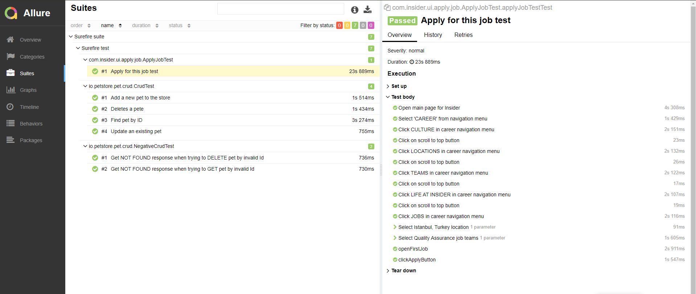
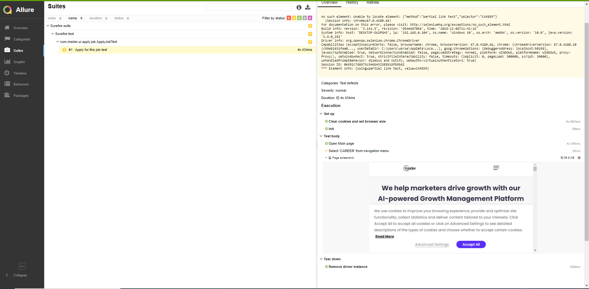
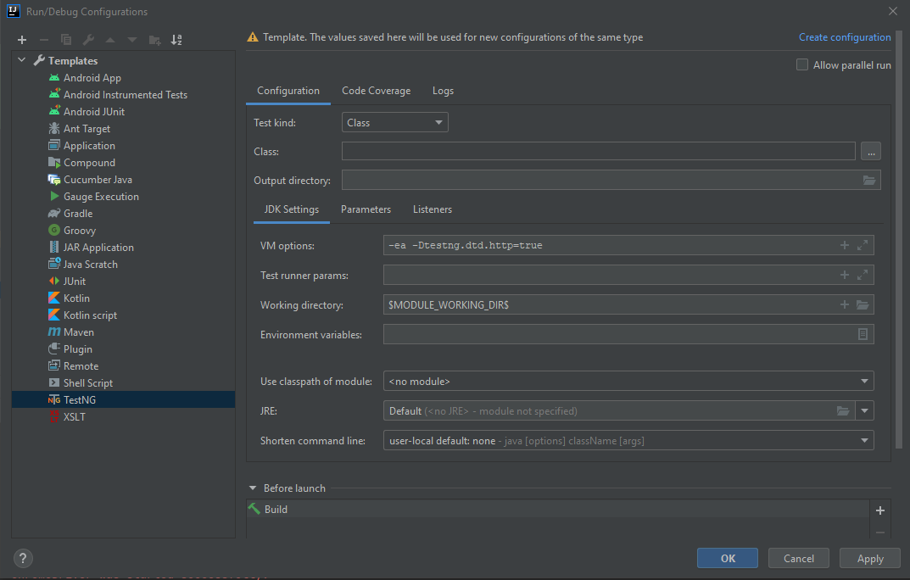

# Insider Test Automation
Chrome driver version 87.0.4280.20
Geckodriver version 0.28.0

## Run test using command line
- Run all tests: 
```shell script
mvn clean test
```
- Single test class: 
```shell script
mvn clean -Dtest=SimpleTest test
```
- Single test method:
```shell script
mvn clean -Dtest=SimpleTest#firstTest test
```
- Specify browser:
```shell script
mvn clean -Dbrowser.type=firefox test
```
- Generate Allure report:
```shell script
- mvn allure:serve
```

## Allure report for passed test
<p align="center">
    
</p>

## Allure report for failed test with screen shot and stack trace
<p align="center">
    
</p>

## If you have a problem with test run from IDE, you need to add config for TestNg runner
-ea -Dtestng.dtd.http=true
<p align="center">
    
</p>